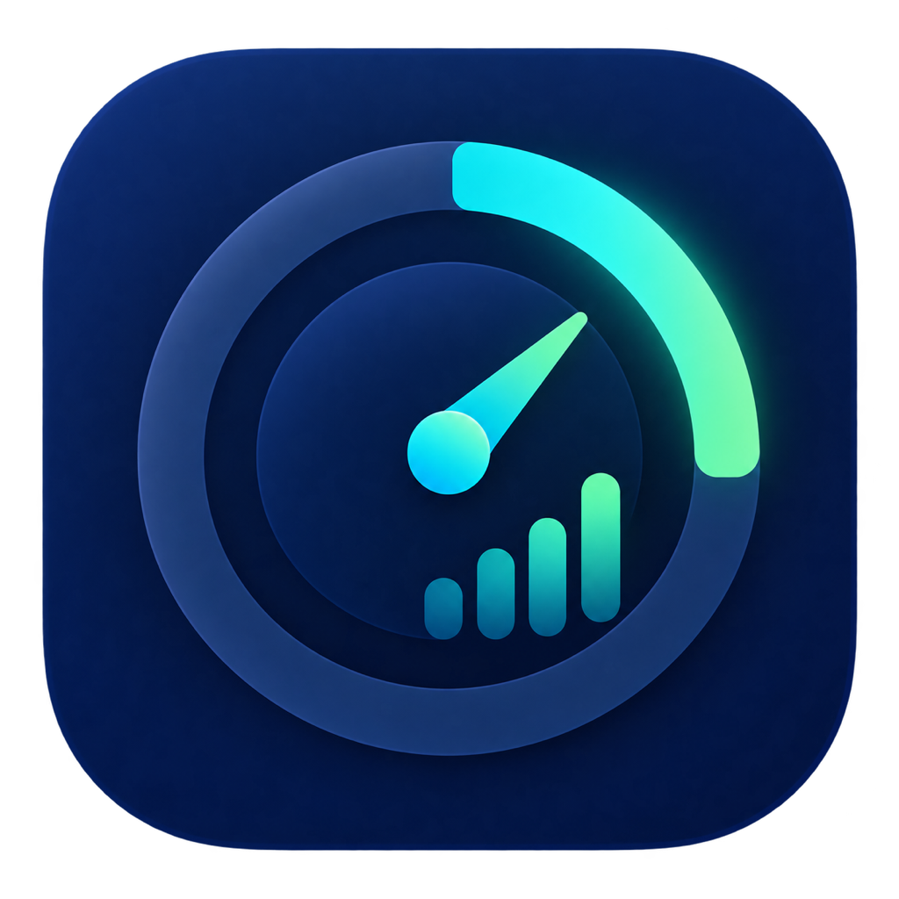

<div align="center">



# Codex 额度

一个轻量、原生的 macOS 菜单栏 Codex 额度监控工具。

[](#系统要求)
[](Package.swift)
[](CHANGELOG.md)
[](LICENSE)

</div>

这是由 [wilsoncc0514](https://github.com/wilsoncc0514) 维护的 Codex 额度版本。它通过新版 ChatGPT.app 内置的 App Server 查询当前额度，并把最关键的信息放在菜单栏里：

```text
61% | 3h08m
```

它没有自己的后端；实时查询只使用 ChatGPT.app 内置 CLI 的现有登录状态。不会调用旧版 Codex.app、PATH、Homebrew 或其他独立 `codex` CLI。实时查询不可用时，会自动降级读取本机会话日志。

当前版本包含实时 5 小时与周额度、刷新时的状态栏额度轮播、本地日志/缓存回退、额度恢复通知、登录时启动和隐私安全诊断。

## 界面预览


菜单栏状态会跟随 5 小时剩余额度变色：


## 它能做什么

- 在主面板直接展示使用限额重置的可用次数和逐张到期时间（系统本地时区），无需二次点击。多张卡片可在明细区域滚动；仅展示，不消耗重置卡。
- 重置卡数据来自 App Server 的 `rateLimitResetCredits`：次数以 `availableCount` 为准，明细缺失时明确提示；日志/缓存降级时不推测次数。接口字段见 [官方说明](https://learn.chatgpt.com/docs/app-server#6-rate-limits-chatgpt)。
- 只通过新版 ChatGPT.app 内置 App Server 实时查询额度
- 查询前检查 ChatGPT 登录状态
- 未登录时给出明确提示，并可打开 ChatGPT 登录
- 支持官方多额度桶格式，并动态识别 5 小时、周额度及其他窗口
- 在菜单栏显示主要额度和恢复倒计时
- 区分数据产生时间、检查时间、延迟和过期状态
- 手动刷新会主动查询官方额度
- 以 60 秒轮询和会话日志变更监听更新额度
- 自然重置时发送本地通知
- 检测计划外的额度提前恢复或大幅回升，二次确认后通知
- 跨重启记录已通知事件，避免重复提醒
- 官方查询失败时自动降级到 JSONL 日志或本机缓存
- 明确显示“官方实时接口”“会话日志（降级）”等数据来源
- 可选额度本地通知，包括低额度、自然重置和计划外恢复
- 可选登录时启动
- 可选语音播报，支持 1 / 5 / 10 分钟间隔
- 可复制不含会话内容的诊断信息
- 不读取或上传提示词、回复、附件及认证文件
- 不搜索或执行旧版独立 Codex CLI

## 安装运行

先把代码拉到本地：

```sh
git clone https://github.com/wilsoncc0514/codex-meter.git
cd codex-meter
```

构建 app：

```sh
./scripts/build-app.sh
```

启动或重启：

```sh
./scripts/restart.sh
```

构建后的 app 会出现在：

```text
build/Codex 额度.app
```

你也可以直接用 Swift Package 跑：

```sh
swift run CodexMeter
```

运行测试：

```sh
swift test
```

生成带校验文件的分享包：

```sh
./scripts/package-release.sh
```

构建 Apple Silicon + Intel 通用版本：

```sh
CODEX_METER_UNIVERSAL=1 ./scripts/package-release.sh
```

## 数据从哪里来

默认情况下，Codex 额度只启动新版 ChatGPT.app 内置的 `codex app-server`，按 App Server 协议调用：

```text
initialize
initialized
account/rateLimits/read
```

只检查以下 ChatGPT.app 位置：

1. macOS 根据 ChatGPT Bundle ID 注册的位置
2. `/Applications/ChatGPT.app`
3. `~/Applications/ChatGPT.app`

不会检查 `Codex.app`、`CODEX_CLI_PATH`、Homebrew、MacPorts、`PATH` 或常见用户级独立 CLI 路径。

如果 ChatGPT 实时查询失败，应用会扫描以下目录，并只解析日志中的 `payload.rate_limits`：

```text
~/.codex/sessions
~/.codex/archived_sessions
```

面板顶部会明确显示当前使用的是官方实时接口、会话日志还是本机缓存。

对连接关闭和分阶段查询超时，Meter 会先清理旧 App Server 子进程，再进行一次短间隔重试。
如果仍未恢复，会显示“实时查询异常”并在 10 秒后自动再次查询；登录、安装或协议错误不会盲目重试。诊断信息会指出超时发生在初始化、账户读取还是额度读取阶段。

## 项目结构

```text
.
├── Package.swift
├── README.md
├── LICENSE
├── Resources/
│   └── AppIcon-1024.png
├── scripts/
│   ├── build-app.sh
│   ├── package-release.sh
│   ├── notarize-release.sh
│   ├── probe-app-server.mjs
│   └── restart.sh
├── Sources/
│   ├── CodexMeter/
│   │   ├── CodexAppServerClient.swift
│   │   └── CodexMeterApp.swift
│   └── CodexMeterCore/
│       ├── AppServerQuotaParser.swift
│       └── QuotaReader.swift
└── Tests/
    └── CodexMeterCoreTests/
```

## 系统要求

- macOS 14 或更新版本
- Swift 6 工具链
- 实时查询需要安装新版 ChatGPT.app
- JSONL 降级模式需要本机有 Codex 会话日志

## 常见问题

**菜单栏没有出现？**  
先运行 `./scripts/restart.sh`。如果菜单栏空间太挤，macOS 也可能把它藏起来。

**额度看起来不准？**  
先查看面板顶部的数据来源。“官方实时接口”表示来自 ChatGPT.app 内置 App Server；“会话日志（降级）”或“本机缓存（降级）”表示实时查询失败。将鼠标停在来源文字上，或使用“更多 → 复制诊断信息”查看原因。

**手动刷新没有变化？**

刷新按钮会通过 ChatGPT.app 内置 CLI 主动调用 `account/rateLimits/read`。如果发生降级，诊断信息会显示超时、未找到 ChatGPT.app 或服务端错误。

开发者也可以运行 `node scripts/probe-app-server.mjs` 单独验证 App Server。探针只输出 CLI 版本、账户类型、套餐类型和额度百分比，不输出 Token、邮箱或会话内容。

**计划外额度恢复如何判断？**

应用无法从官方字段获知恢复原因，因此不会断言是活动或全体用户重置。它会检测原定恢复时间之前切换到新周期，或同一周期内剩余额度突然大幅上升；候选事件会在 8 秒后再次查询确认。通知会标为“额度提前恢复”或“额度大幅回升”。

**为什么没有收到重置通知？**

请在“更多 → 额度通知”中开启权限，并保持 Codex 额度运行。Mac 休眠期间发生的自然重置会在唤醒查询后补发；首次安装且没有历史额度基线时不会通知。

**是否必须打开 Codex 才能获取额度？**

不需要打开 ChatGPT 界面。启用“登录时启动”后，Meter 会直接启动 ChatGPT.app 内置 App Server。只要网络可用、ChatGPT.app 已安装且已登录，就能查询。旧版 Codex.app 或独立 Codex CLI 不会被使用。

**分享给别人会带上我的账户吗？**

不会。安装包不包含账户、Token、邮箱或认证文件。每位用户需要在自己的 Mac 上安装新版 ChatGPT.app，并使用自己的 ChatGPT 账户登录一次。Meter 通过 `account/read` 检查登录模式，但不缓存、显示或写入账户邮箱和 Token。

**显示“格式暂不兼容”？**

Codex 日志格式可能发生变化。使用“更多 → 复制诊断信息”提交问题；诊断内容不会包含提示词或回复。

**为什么只显示周额度？**

应用只显示 Codex 当前实际写入日志的窗口，不会把周额度误标为 5 小时额度。

**如何正式分发？**

默认构建使用临时本地签名，适合本机或熟人测试。公开分发需要设置 `CODEX_METER_SIGN_IDENTITY` 使用 Developer ID 签名，并通过 `scripts/notarize-release.sh` 调用 Apple 公证；这需要有效的 Apple Developer 凭据。

## 隐私

Codex 额度不读取认证文件，也不读取或上传会话中的提示词、回复和附件。它只启动 ChatGPT.app 内置 App Server；认证由 ChatGPT 自己处理。应用不保存账户邮箱或 Token。降级模式只在本机读取 JSONL 中的额度字段。

## 许可证

[MIT](LICENSE)

## 来源与致谢

本项目最初基于 [HappyChenchen/codex-meter](https://github.com/HappyChenchen/codex-meter) 的
[`v0.1.0` / `b49a16f`](https://github.com/HappyChenchen/codex-meter/commit/b49a16f66c8d1e88aa99bcf2fef185f55989670b)
演进，并继续遵循 MIT License。感谢原项目提供菜单栏额度工具的初始实现。

当前的“Codex 额度”版本由 [wilsoncc0514](https://github.com/wilsoncc0514) 独立维护，后续新增了
ChatGPT.app 本地 App Server 实时查询、隐私边界、缓存回退、通知、状态栏额度轮播、图标及发布流程。
仓库独立维护不代表原作者或 OpenAI 对当前版本提供背书。

## 说明

这个项目不是 OpenAI 官方项目。实时额度来自新版 ChatGPT.app 内置 App Server；该接口并非面向第三方承诺长期稳定的公开接口。降级状态下的数据可能与服务端真实状态存在短暂差异。
